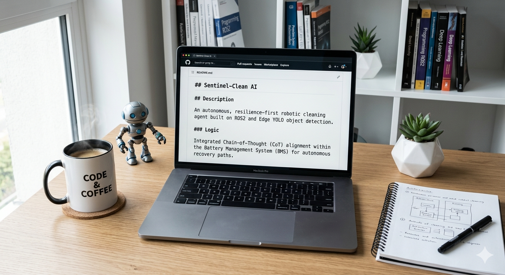

# Hi, I'm Cuong Dang 👋

Developing Resilient AI, Robotics, and Secure Systems.

---

### 🛡️ About Me
* **Current Focus:** AI in Cybersecurity and AI & Robotics Student at Houston City College (HCC) 🏥
* **Interests:** Investigating SaaS threats, Identity Protection, Autonomous Robotics, and Multi-Agent Orchestration 🚀
* **Philosophy:** Combining modern AI with robust systems engineering and advanced automation

---

### 🛠️ Tech Stack & Skills

| Category | Technologies & Frameworks |
| :--- | :--- |
| **Languages** | Python, C++, SQL |
| **AI / Machine Learning** | YOLO (Object Detection), Vision Transformers (ViT), MediaPipe, LLM Prompt Engineering (CoT/Few-Shot) |
| **Robotics** | ROS2 (Robot Operating System), SLAM, Sensor Fusion, Multi-Agent Systems, HRI Frameworks |
| **Networking & Security** | LAN Routing & Switching, Network Hardening, Cloud Security, MITRE ATT&CK Framework |

---

### 🚀 Selected Projects

#### 🤖 [Sentinel-Clean AI](https://github.com/binxixi23/sentinel-clean-ai)
* **Description:** A Resilience-First autonomous cleaning agent built on ROS2 and Edge YOLO object detection.
* **Core Logic:** Integrated Chain-of-Thought (CoT) alignment within the Battery Management System (BMS) for autonomous recovery paths.

#### 🏥 [AI-Easy-Test](https://github.com/binxixi23/AI-Easy-Test)
* **Description:** An autonomous, AI-driven robotic phlebotomy system.
* **Features:** Real-time vein detection, precise robotic blood extraction workflows, and automated instant diagnostic reporting.

#### 💅 [MyThu-AI-Hybrid-Nail-Sanctuary](https://github.com/binxixi23/MyThu-AI-Hybrid-Nail-Sanctuary)
* **Description:** An expert system agent that programmatically translates 20+ years of craftsmanship domain knowledge into AI logic.
* **Features:** Uses Retrieval-Augmented Generation (RAG) and 500+ rule mappings to provide automated consultations, skin-tone analysis, and 3D design logic.

#### 🔒 [Canvas-Incident-Response-Project](https://github.com/binxixi23/Canvas-Incident-Response-Project)
* **Description:** A detailed technical analysis and incident response case study of the 2026 Canvas/Instructure cybersecurity breach.
* **Focus:** Documented OAuth token theft mechanics and designed theoretical Recurrent Neural Network (RNN) sequence detection models for identity protection.

---

### 📫 Connect With Me
* **LinkedIn:** www.linkedin.com/in/cuong-dang-bb42a0385
* **Email:** binxixi23@gmail.com

---

## 👥 Course Team Members & Git Branches

This repository is a collaborative project for the **Intro to Machine Learning (ITAI-1371)** course. Below is our team directory and the Git branching strategy utilized to verify individual commit contributions:

| Team Member | Project Role | Assigned Git Feature Branch |
| :--- | :--- | :--- |
| 👑 **Cuong Dang** | Team Lead & Repository Creator | `main` (Initial Repository Architecture) |
| 🚀 **Jonathan Aldana** | Project Contributor | `feature/hello-jonathan` |
| 🚀 **Astríd Lorenzana** | Project Contributor | `feature/hello-astrid` |
| 🚀 **Ruben Nuno** | Project Contributor | `feature/hello-ruben` |
| 🚀 **Dana Bolden** | Project Contributor | `feature/hello-dana` |

### 🛠️ Execution Rules

* Every member must clone the repository locally.
* No team member is allowed to push code directly to the `main` branch.
* A strict Peer-Review Pull Request (PR) workflow must be verified before merging greetings into `hello_ml.txt`.

